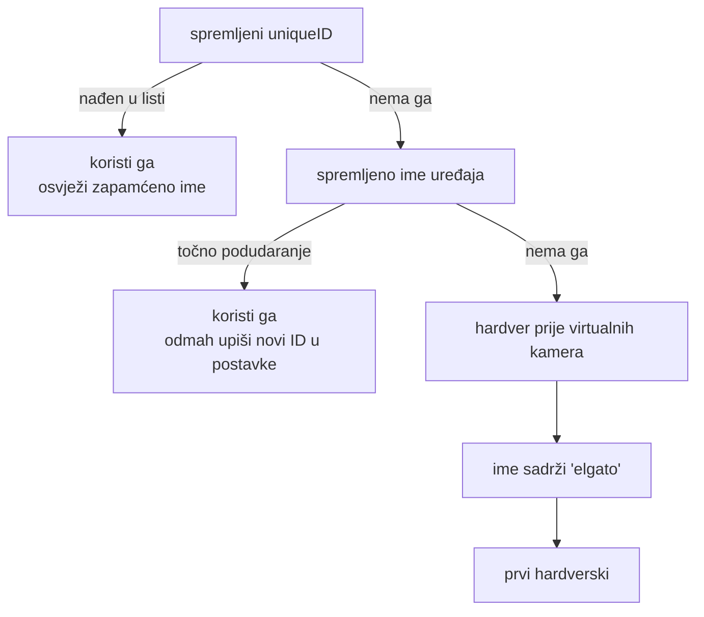

# Naučeno tijekom izrade — stvari koje se ne vide iz koda

Zapisano 2026-07-25, prije prve probe na pravom hardveru. Sve niže je ili
**izmjereno** na ovom Macu, ili **bug koji je stvarno pronađen** testom. Nije
teorija.

---

## Brojevi koje ne treba ponovno mjeriti

### Platforma

| Stvar | Vrijednost | Kako znam |
|---|---|---|
| `/bin/bash` na macOS-u | **3.2.57** | `bash --version`. Nema asocijativnih polja — `declare -A` puca. Skripte moraju biti bash 3.2 kompatibilne. |
| `duration_ts` za WAV | = broj uzoraka | `time_base=1/48000`, pa je `duration_ts` točan broj uzoraka. Koristi to, ne `duration × rate`. |
| `atrim=end_sample=N` | točan do uzorka | Izmjereno: 0,000 ms odstupanja. |
| `asetrate`+`aresample` bez splita | **0 ms** greške | 1, 2, 6 i 18 dijelova s identičnim rateom → svi 600,000000 s. |
| `asetrate`+`aresample` s promjenom ratea | **+1–2 ms po operaciji** | Resampler flush doda ~100–200 uzoraka na kraj. Akumulira se po dijelu → obavezno rezati na `end_sample`. |
| `-itsscale X` uz `-c copy` | skalira trajanje točno za X | 100 s → 100,099935 s pri X=1.001. Ni jedan frame se ne renderira. |
| `AVAssetImageGenerator` s nultim tolerancijama | vraća točno traženi frame | 13 frameova oko trenutka = 13 različitih trenutaka. S ne-nultom tolerancijom vratio bi isti keyframe i tiho uništio mjerenje. |
| Brzina zvuka u kalibraciji | ~2,9 ms/m | Pljesak na 2 m unosi 6 ms greške. Zato „blizu kamere" nije savjet nego zahtjev. |
| Gain PodMica USB kroz CoreAudio | **22–63 dB, promjenjiv** | `kAudioDevicePropertyVolumeDecibels`, ulazni scope, element 0. Upis prolazi i dok RØDE Connect radi. RØDE Connect sam **nema** AppleScript rječnik ni URL shemu. Vidi `scripts/mic_gain.swift`. |
| ID-evi audio uređaja | **nisu stabilni** | Isti PodMic bio 184 pa 186 u istoj sesiji. Nabrajaj iznova, ne pamti ID. |
| AAC enkoder i true peak | **+0,7 do +1,5 dB nakon limitera** | Limiter na −2 dBFS → izmjereno −0,6 dBTP na gotovom 384k AAC-u. Isto što `fetch.domovina.tv/docs/loudness_normalization_2026-05.md` zove „zamka 3". |
| Korelacija mikrofon↔kamerin zvuk | **±15 ms, ne bolje** | Različiti mikrofoni, različit signal → vrh korelacije je širok. Dva vrha unutar 12 ms znala su biti jednake visine. Za finiju provjeru usporedi izlaz s **istim** signalom (miksom), ne s kamerom. |

### Nelinearnost drifta kroz snimku

Ista termalna krivulja (kristal se smiruje s 40 na 12 ppm), različite duljine.
„Odstupanje od pravca" je rezidual koji ostaje ako se primijeni **jedan** globalni
resample odnos:

| Duljina snimke | Odstupanje od pravca | Odluka |
|---|---|---|
| 10 min | 1,9 ms | jedan odnos je dovoljan |
| 60 min | 10,5 ms | po dijelovima |
| 180 min | **31,1 ms** | po dijelovima, obavezno |

**Prijelaz je oko 50 minuta** (prag u skripti je 8 ms). Zato podcast od 20 minuta
nikad nije otkrio problem, a epizoda od 3 sata bi ga otkrila u montaži.

### Bitrate proxyja — koliko je dovoljno

Izmjereno na stvarnoj 4K30 snimci iz ovog studija, VMAF (4K model) protiv starog
izlaza od 60 Mbit/s:

| bitrate | GB/h | VMAF | |
|---|---|---|---|
| 6 Mbit/s | 2,6 | 93,75 | vidljivo mekše |
| 8 Mbit/s | 3,4 | 96,20 | otprilike gdje je Riverside |
| **12 Mbit/s** | **5,1** | **97,43** | **odabrano** |
| 20 Mbit/s | 8,6 | 98,36 | +0,9 VMAF za +3,5 GB/h |
| 30 Mbit/s | 12,8 | 98,66 | +0,3 VMAF za još +4,2 GB/h |

Krivulja je ravna nakon 12. Statična kamera na dvoje ljudi koji pričaju je
otprilike najlakše što encoder može dobiti — gotovo sve iznad toga odlazi u šum
senzora.

Cijela sesija: **7,5 GB/h** (video 5,5 + audio 2,0), tj. **15 GB za epizodu od
120 minuta** umjesto 58 GB.

Bitno je što je ta datoteka: master je SD kartica u kameri, a ovo je vremenska
referenca za poravnanje i rezerva ako kartica zakaže. Pri 12 Mbit/s je i dalje
mirno objavljiva sama za sebe.

### Perceptivni pragovi

Zvuk koji **pretječe** sliku smeta oko dvostruko više od zvuka koji zaostaje —
grubo −45 ms naprijed vs +90 ms nazad. Latencija lanca (video označen kasnije) daje
upravo smjer „zvuk naprijed", pa je neispravljena greška od ~90 ms jasno vidljiva.

---

## Bugovi koje su testovi pronašli

Svaki od ovih je prošao pregled koda i pao na testu. Vrijedi ih pamtiti kao klase
grešaka, ne kao pojedinačne slučajeve.

### 1. `if p.get("frameCount")` — nula je falsy

Prva točka trajektorije drifta legitimno ima `frameCount: 0`. Truthiness provjera
ju je tiho odbacila, pa je baseline pomaknut na 30. sekundu — a to **skalira svaku
per-interval frekvenciju** za ~30 ppm. Rezultat: ispravak drifta radi u pogrešnom
smjeru, i nitko to ne bi primijetio bez provjere do uzorka.

> Pravilo: za numeričke vrijednosti iz JSON-a uvijek `is not None`, nikad truthiness.

### 2. Tab je IFS whitespace u bashu

`read -r a b c` s `IFS=$'\t'` **skuplja** susjedne tabove, pa prazno polje u TSV-u
pomakne sve kasnije stupce lijevo. Manifest je javljao trajanje `yes`.

> Pravilo: emitter nikad ne šalje prazno polje — umjesto praznog ide `-`.

### 3. `$VAR…` — trotočka postaje dio imena varijable

`echo "Pakiram $APP_BUNDLE…"` → bash čita ime varijable kao `APP_BUNDLE\xe2\x80\xa6`
i pod `set -u` puca s „unbound variable". Pogađa svaki ne-ASCII znak odmah nakon
imena varijable.

> Pravilo: `${VAR}` uvijek kad slijedi bilo što osim razmaka ili interpunkcije iz ASCII-ja.

### 4. Mjerenje razine samo na kanalu 0

RØDE Connect virtualni uređaj je 2-kanalni; isto i dva mikrofona panirana hard
L/R. Glas na desnom kanalu = mjerač pokazuje ništa = **alarm za mrtvi mikrofon na
zdravom ulazu.**

### 5. Auto-dodjela po imenu koje sadrži „rode"

Na Macu s RØDE Connectom postoje tri virtualna uređaja. Filtar po imenu je
`RØDE Connect System` — **zvuk sustava** — dodijelio kao mikrofon. Snimalo bi ono
što Mac pušta kao gosta u podcastu.

### 6. Mjereno, a nikad primijenjeno

Korelator je mjerio pomak mikrofon→slika svake sekunde i prikazivao ga na ekranu.
Broj nije nikad išao u manifest ni u skriptu — poravnavanje je koristilo samo host
clock. Feature je izgledao gotov i bio je dekorativan.

> Pravilo: „mjerimo X" i „primjenjujemo X" su dvije različite tvrdnje. Provjeri
> putanju podataka do izlazne datoteke, ne do UI-ja.

### 7. Upload bez oporavka

Segmenti su se slali na R2 tijekom snimanja, ali nije postojao način da se sesija
iz njih rekonstruira. Uz to je `segmentType` bio odbacivan, pa se initialization
segment (nosi `moov` box) nije mogao razlikovati od media fragmenata.

> Pravilo: disaster recovery bez testiranog alata za oporavak nije disaster recovery.

### 8. Pogrešno zapamćen test vektor

Testirao sam SigV4 protiv AWS-ovog primjera i dobio neslaganje. Canonical request
hash se poklapao, potpis nije. Uzrok: tajni ključ u AWS-ovim **S3** primjerima je
`...MDENG/bPxRfi...` s **kosom crtom**, a ne `+` kao u većini drugih AWS primjera.
Implementacija je bila ispravna, test pogrešan.

> Pravilo: kad se dvije neovisne implementacije poklope a „očekivana" vrijednost ne,
> posumnjaj u očekivanu vrijednost. Provjeri izvor, ne pamćenje.

### 9. `forImportantUsage` vraća 0 na exFAT-u

Preflight je odbijao **svako** snimanje na vanjski disk s porukom „0 GB". Uzrok:
`volumeAvailableCapacityForImportantUsageKey` postoji samo na APFS/HFS+; na exFAT-u
vrati 0 umjesto `nil`, pa je provjera „ima li 20 GB" uvijek padala. A vanjski disk
je jedino mjesto gdje epizoda od tri sata i pripada.

> Pravilo: `resourceValues` ključ koji ne postoji na tom filesystemu ne javlja
> grešku — vrati bezopasno izgledajuću nulu. Uvijek imaj fallback (`volumeAvailableCapacityKey`).

### 10. Statistike pročitane nakon otpuštanja recordera

`stopRecording()` je zvao `teardownRecorders()` (koji radi `recorders.removeAll()`)
**prije** `writeFinalTrackStatistics()`. Statistike se čitaju s tih istih objekata,
pa je rječnik bio prazan i manifest je ostajao bez `firstSampleHostNanos`,
`sampleCount`, `measuredSampleRate` i `driftPPM` za svaki mikrofon.

Ništa nije puklo. `finalize_session.sh` za `firstSampleHostNanos = None` uzima
`offset = 0.0`, pa bi svaka snimka izašla tiho pomaknuta za stvarnu razliku
starta — ovdje izmjereno **+214 ms i +398 ms**. To je 5–10× iznad praga
vidljivosti.

> Pravilo: redoslijed „oslobodi pa pročitaj" ne javlja grešku ni u Swiftu ni u
> Pythonu — samo vrati prazno. Test koji gleda samo „je li datoteka nastala" ovo
> nikad ne uhvati; treba gledati sadržaj manifesta.

### 11. `nominalFrameRate` je maksimum formata, ne ono što kamera šalje

Elgato 4K X u `activeFormat` javlja **120 fps** na 3840×2160 — to je što *capture
uređaj* može, ne što GH5 na drugom kraju kabela šalje. Stvarno izmjereno: **29,970
fps** (točno NTSC 30000/1001, potvrđeno neovisno ffprobeom). Manifest je taj broj
prenosio dalje u postprodukciju, a encoder ga je dobivao kao
`AVVideoExpectedSourceFrameRateKey`.

Zanimljivo: ista sesija, dva pokretanja, jednom javi 30 a jednom 120 — ovisno o
tome koji je format uređaj zatekao aktivnim. Nestabilan broj je gori od krivog.

> Pravilo: sve što dolazi iz `activeFormat` je sposobnost, ne mjerenje. Mjeri protiv
> host clocka i zapiši `measuredFrameRate`, kao što se već radilo za `measuredSampleRate`.

### 12. Manifest je bilježio segmente koje nitko nije zapisao

`UploadQueue.enqueue` počinje s `guard client != nil else { return }`, pa se s
isključenim R2 fMP4 chunkovi tiho odbace. Manifest ih je svejedno upisivao s
`relativePath: "segments/video/…"` — 18 segmenata s putanjama do datoteka koje ne
postoje. Oporavak sesije ide upravo po tim putanjama.

> Pravilo: ako zapis u manifestu ovisi o tome je li neki drugi sloj *stvarno* nešto
> zapisao, gate-aj ga istim uvjetom. `relativePath` je `String?` — nil je ispravan
> odgovor kad datoteke nema.

### 13. `ArrayTooSmall` na predimenzioniranom bufferu — lip sync nikad nije radio

Najskuplji bug u cijelom projektu, i najbolje skriven.

`forwardAudioForMonitoring` je rezervirao `AudioBufferList` s mjesta za 8 buffera
„za svaki slučaj". `CMSampleBufferGetAudioBufferListWithRetainedBlockBuffer`
provjerava `bufferListSize` na **jednakost**, ne na „ima li dovoljno mjesta", pa je
odbijao **svaki** sample buffer s `kCMSampleBufferError_ArrayTooSmall` (−12737):
dali smo 152 bajta, tražio je točno 24 (interleaved stereo = jedan buffer).

Ime greške kaže suprotno od onoga što se dogodilo — „premalo polje" na polju koje
je šest puta preveliko.

Posljedica: korelator **nikad** nije dobio nijedan uzorak s kamere. Live lip sync
meter je stajao na 0,00, `syncMeasurements` je ostajao prazan, a poruka pri
zaustavljanju je krivca tražila na drugom mjestu — „provjeri je li HDMI zvuk iz
kamere bio odabran". Dijagnostika koja optužuje hardver za vlastiti bug pošalje te
u krivom smjeru na sate.

Nakon popravka: **15/15 pouzdanih mjerenja, +153,0 ms**, stabilno kroz snimku.

> Pravilo: kod CoreMedia „size needed" API-ja uvijek pitaj prvo za veličinu
> (`bufferListSizeNeededOut` s `bufferListOut: nil`), pa alociraj **točno** toliko.
> Rezerva „za svaki slučaj" nije neutralna.
>
> I šire: kad dijagnostika krivi hardver, provjeri da put kojim podatak dolazi
> uopće radi. Snimka je cijelo vrijeme imala uredan zvuk u `camera-proxy.mov` —
> writer put je radio, monitor put nije, i nitko ih nije usporedio.

### 14. „Prostor za normalizaciju" koji je pojačao umjesto spustio

`rebuild_mix.sh` je izvorno htio spustiti gotov miks na fiksnih −20 LUFS, „da
finalna normalizacija ima prostora". Miks je bio na −42,3 LUFS, pa je izračun
`-20 − (−42,3)` dao **+22,3 dB** — pojačanje, ne spuštanje. Bez limitera. Rezultat
je bio tvrdo klipanje kroz cijelu snimku: sample peak točno 0,000 dB, true peak
+1,0 dBFS.

Poruka u logu je govorila „spuštam za 22.3 dB" jer je tekst bio napisan uz
pretpostavku da je vrijednost negativna. **Ispis je tvrdio suprotno od onoga što je
kod radio.**

> Uhvaćeno mjerenjem izlaza, ne pregledom koda — `ebur128` je pokazao vrh iznad
> nule, što u 24-bitnom PCM-u nije moguće bez klipanja.
>
> Pravilo koje je iz toga ušlo u lanac: **normalizaciju radi točno jedan alat.**
> `rebuild_mix.sh` sada namjerno ostavlja miks na prirodnoj razini; pojačanje i
> limiter su samo u `finalize_backup.sh`.

### 15. Denoise modeli hranjeni signalom 30 dB pretihim

Prvi krug testova čišćenja šuma davao je DeepFilterNetu i RNNoiseu miks na
**−47 LUFS**. Modeli su trenirani na govoru normalne razine i takav signal čitaju kao
šum — jedan ga je uništio, drugi nije prepoznao ništa.

> Redoslijed je obavezan: **pojačaj na ~−20 LUFS → očisti → normaliziraj na cilj.**
> Vidi [`CISCENJE_ZVUKA.md`](CISCENJE_ZVUKA.md).

---

## Izmjereno na pravom hardveru

`./scripts/test_hardware.sh` — 75 s snimke, 2× PodMic USB + GH5 preko Elgato 4K X,
2026-07-27. Test sam proizvede zvuk (nepravilni udari šuma kroz zvučnike), jer se
sinkronizacija ne može izmjeriti u tihoj sobi.

| Pretpostavka | Ishod |
|---|---|
| `AVAudioEngine` startaju paralelno, po jedan na svoj HAL uređaj, bez Aggregate Devicea | ✅ radi. Dva `AVAudioEngine`a, dva HAL uređaja, bez ijednog konflikta |
| Stvarni drift PodMic USB kristala | ✅ **−21,5 i −21,0 ppm**, stabilno kroz cijelu snimku. Daleko unutar tolerancije — nikakav interface nije potreban |
| Elgato 4K X `activeFormat` | ⚠️ javlja 3840×2160 **@ 120 fps**; stvarno stiže 29,970. Vidi bug 11 |
| `AVAssetWriter` HEVC na 4K u realnom vremenu | ✅ **0 ispuštenih frameova** u 75 s na 4K30. **29,3 GB/h** izmjereno — stara paušalna procjena od 9 GB/h bila je tri puta preoptimistična (vidi bug 9 i `approximateGigabytesPerHour`) |
| `.mpeg4AppleHLS` profil daje fMP4 segmente | ✅ 19 segmenata + inicijalizacijski, ispravno označen |
| HDMI zvuk je stvarno kamerin mikrofon | ✅ **da — ali su ga blokirale dvije neovisne stvari.** Elgato 4K X je u Elgato Studiju bio na **Analog** audio ulazu umjesto HDMI (−71 dB konstantno). Nakon prebacivanja na HDMI zvuk je živ (−36 dB), ali korelator ga i dalje nije vidio zbog buga 13 |
| Latencija mikrofon→HDMI zvuk | ✅ **+153 ms** i **+225 ms** u dva pokretanja, unutar snimke stabilno na ±10 ms. Konstanta je po sesiji, ne po sustavu — zato se mjeri svaki put i sprema u manifest, umjesto da se jednom izmjeri i zapamti |
| Razlika starta tragova | ✅ +222 ms i +402 ms od početka sesije — točno ono zbog čega postoji `firstSampleHostNanos` |

Host clock i korelator se **ne poklapaju i ne trebaju**: sat je javio −229 ms, a
korelator +160 ms. Sat vidi samo kad je podatak stigao do drivera; +153 ms je
stvarna latencija lanca koju sat po definiciji ne može izmjeriti. Zato korelator
nije „provjera sata" nego jedini izvor tog broja.

Preostaje kalibracija pljeskom da se +153 ms (mikrofon→HDMI **zvuk**) pretvori u
mikrofon→**slika**. Bez nje postprodukcija pretpostavlja da je kamera interno
poravnata.

Još neprovjereno: termika kroz 3 sata pod trajnim encodeom, i `proRes422LT` na 4K.

---

## Odluke i zašto, u jednoj rečenici svaka

* **Bez Aggregate Devicea** — HAL bi tiho resamplirao i ne bi rekao koliko; ovako
  se drift mjeri i zapisuje.
* **Medijan, ne prosjek**, za pomak mikrofon→slika — u tišini korelacija daje
  besmislice, a jedan izlet od −400 ms uništi prosjek.
* **Trajektorija, ne samo prosjek**, za drift — samo niz može razlikovati
  konstantan pomak od onog koji šeta kroz 180 minuta.
* **Segment po objektu** na R2 tijekom snimanja — R2 zahtijeva identične veličine
  multipart dijelova, što je nezgodno za stream nepoznate duljine.
* **Listanje buketa, ne manifest**, pri oporavku — manifest se šalje tek pri
  zaustavljanju, pa ga kod pada nema.
* **Dva prolaza** pri poravnavanju (drift, pa pomak) — u jednom prolazu ispravak po
  dijelovima nije izvediv.
* **`-itsscale` umjesto re-encodea** za drift kamerinog sata — skalira samo
  timestampove, ostaje zero-render.
* **Čovjek bira frame kontakta pljeska** — pljesak nema svjetlosni potpis, pa
  automatska detekcija nije moguća; oko to prepozna trenutačno i traje jedan klik.
* **Sve granice u uzorcima, ne u sekundama** — sekunde uvode zaokruživanje, a
  `atrim=start_sample`/`end_sample` je egzaktan.

## Post iz aplikacije i AI priprema za YouTube (2026-07-28, drugi krug)

Znanje iz sesije u kojoj je Post tab dobio in-app izvoz i AI pripremu:

* **UI je obećavao flag koji nije postojao.** Post tab je godinama pisao „dodaj
  skripti `--sync-offset-ms`", a `finalize_session.sh` taj argument nije
  parsirao — ručni pomak iz klizača se nije mogao primijeniti nikako. Ista
  klasa greške kao „izmjereno i prikazano ≠ primijenjeno": ovaj put je UI
  pokazivao na sučelje skripte koje nitko nikad nije provjerio. Provjera je
  jedan grep na `"$flag"` u skripti.
* **Aplikacija iz Findera vidi PATH `/usr/bin:/bin` i ništa više.** Alati su na
  ovom Macu u tri prefiksa: ffmpeg u `/opt/homebrew/bin`, `modal` i
  `audio-offset-finder` u `/Library/Frameworks/Python.framework/Versions/3.13/bin`
  (python.org; verzija se mijenja nadogradnjom — glob, ne hardcode), `claude` u
  `~/.local/bin`. ScriptRunner ih dodaje sve tri; torch vidi samo framework
  python (ista logika kao `PYTHON_BIN` u fetch `run_pipeline.sh`).
* **Modal nema API ključ za kopiranje.** Autentikacija je `~/.modal.toml` od
  `modal setup`; fetch `.env` ne sadrži ništa Modal-ovo. HF token za pyannote
  se sam nađe u `~/.cache/huggingface/token` — `diarize_canary.py` ima vlastiti
  resolver, ne treba mu se ništa prosljeđivati.
* **Izmjereno na stvarnom materijalu (3 min iz epizode 2026-07-28):** Canary na
  Modalu 5 s inferencije, pyannote lokalno 7 s (2 govornika, točno), claude
  metapodaci ~1 min. `youtube_delivery.sh` na sintetici: izlaz točno
  −14,0 LUFS, video stream bit-identičan (copy), moov prije mdata.
* **Anti-halucinacijska pravila iz fetch prompta rade i ovdje:** model je na
  testu ignorirao namjerno krivi `--title-hint` („vjera") jer sadržaj govori o
  obiteljskim firmama, i nijedna `[SPEAKER_XX]` oznaka nije procurila u
  naslov/opis/tagove.

## Identitet uređaja i stanje koje preživi promjenu sesije (2026-08-27)

Sesija je krenula od prijave „app kaže da USB Elgato ne postoji, a u Elgato
Studiju normalno vidim HDMI sliku i zvuk".

### Uređaj se ne smije pamtiti po `uniqueID`

| Stvar | Vrijednost | Kako znam |
|---|---|---|
| `AVCaptureDevice.uniqueID` za USB capture | **nije stabilan** | Elgato 4K X se javio kao `0x2100000fd9009c`, a u postavkama je stajalo `0x32100000fd9009c`. To je USB *lokacija* — mijenja se s portom, hubom i rebootom. |
| CoreAudio UID istog uređaja | **stabilan** | `AppleUSBAudioEngine:Elgato:Elgato 4K X:A7SNB40810L0OK:3` nosi serijski broj. HDMI-zvuk izbor je preživio isti događaj netaknut, dok je video pukao. |
| Kamera vidljiva bez dozvole | **da, cijela lista** | S `authorizationStatus == .notDetermined` (svjež bundle id, pokrenut preko `open`) discovery je vratio svih 11 uređaja. |
| Elgato dok Elgato Studio radi | **61 frame u 3 s, 1920×1080** | `isInUseByAnotherApplication = false`. Nema ekskluzivnog zauzeća, dvije aplikacije mogu držati isti UVC ulaz. |

Iz ovoga slijede dva pravila:

1. **Prazan popis uređaja nikad nije problem s dozvolom.** Ako je popis prazan,
   kriv je ID ili filtriran tip uređaja. Dozvola se vidi tek kad se sesija
   pokuša pokrenuti.
2. **Pamti ime uz ID.** Ime preživi promjenu porta; broj ne. Isto vrijedi za
   `AudioObjectID` iz gornje tablice — tamo je rješenje isto, samo je UID već
   stabilan pa se ne mora spašavati.

Redoslijed kojim se izbor vraća:

Filtriranje „virtual" nije kozmetika: na ovom Macu su u listi i *Elgato Virtual
Camera*, OBS, Camo, mmhmm, EOS Webcam Utility i OBSBOT — traženje po imenu
„elgato" može sletjeti na softversku kameru koja daje crnu sliku.

### `nil` kao skriveni prekidač načina rada

Post tab je nakon prvog klika na **Pripremi** zadržavao player prve sesije;
promjena mape ga nije mijenjala. Uzrok nije bio player nego to što je
`load(folder:)` mijenjao manifest, a stanje pregleda ostavljao netaknuto:

* view nudi **Pripremi** samo dok je `preview == nil`, pa se s ne-nil vrijednošću
  gumb više nikad ne pojavi;
* `rebuildPreview` iz `preview != nil` zaključuje da klizač treba tretirati kao
  override — dakle pomak stare snimke bi se primijenio na novu.

Klasa greške: **jedna `nil` provjera nosi dva različita značenja** („nije još
građeno" i „korisnik je ručno pomaknuo"), pa promjena dokumenta mora resetirati
oboje. Kad view ima „dokument" koji se mijenja, svako izvedeno stanje mora imati
jedno mjesto na kojem se ruši — ovdje `resetPreview()`, koji uz to skida
periodični time observer (inače drži player živ i puca po kompoziciji koju više
nitko ne gleda).

### Zašto se popis snimki sortira po `createdAt`

Post sada izlistava sesije iz mape iz Postavki, najnovije prvo. Ključ sortiranja
je `createdAt` iz manifesta, a ne:

* **ime foldera** — `yyyy-MM-dd-HHmm` ide samo do minute; dvije snimke u istoj
  minuti (16:20 i 16:21 iz probe) poredale bi se nasumično;
* **datum datoteke** — kopiranje biblioteke na drugi disk prepiše sve datume, a
  finalizacija jedan.

Nemountan disk je stanje koje se prikazuje (`Mapa sesija nije dostupna: …`), ne
greška koja se proguta u prazan popis. Folder s pokvarenim `manifest.json` se i
dalje izlista i označi — to je upravo snimka do koje netko treba doći.

### Otvoreno

* Popis prikazuje samo mapu iz Postavki. Stariji materijal iz
  `/Volumes/DOMOVINA1TB/podcast_producer_output` (20 snimki iz srpnja) se ne vidi
  dok je biblioteka `podcast_domovina_studio_storage`. Više mapa nije traženo.
* Kalibracija pljeskom i dalje stoji na `-5,5 ms` od 2026-07-28; nije ponovno
  mjerena nakon zamjene porta.
