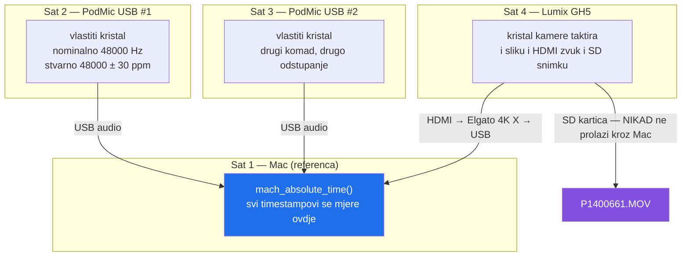
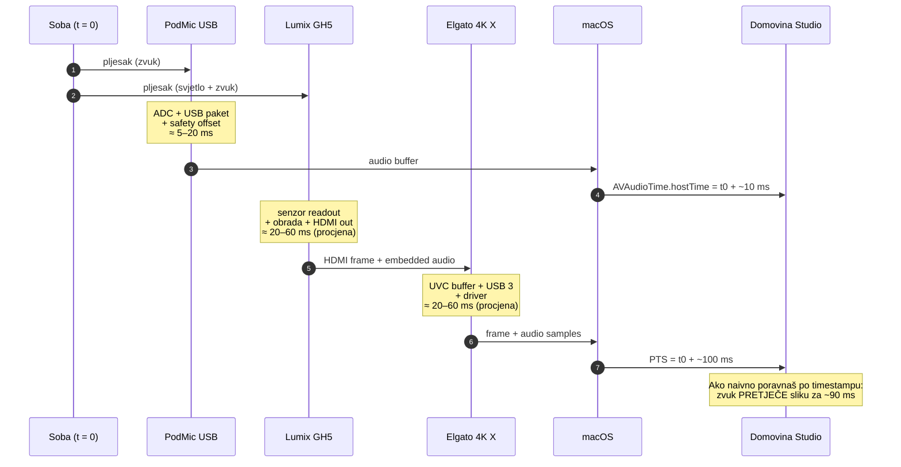
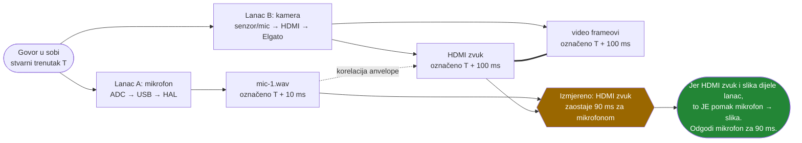
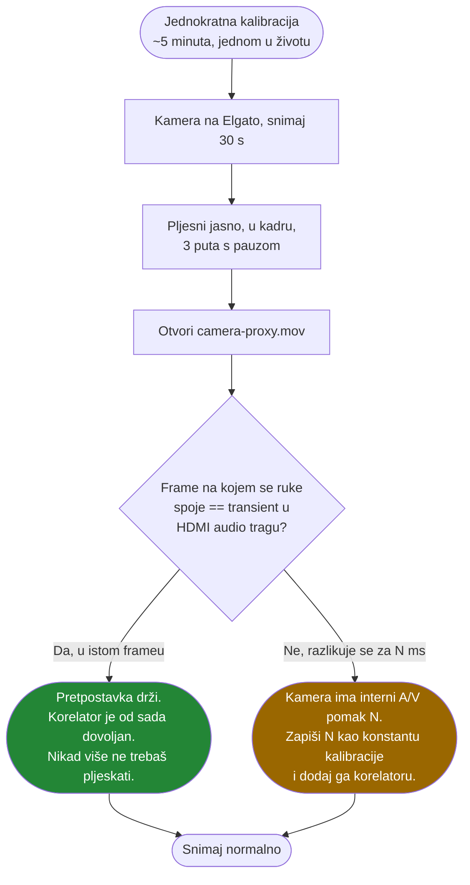
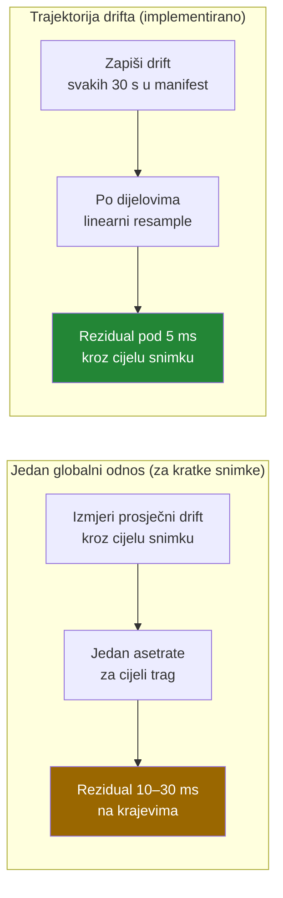
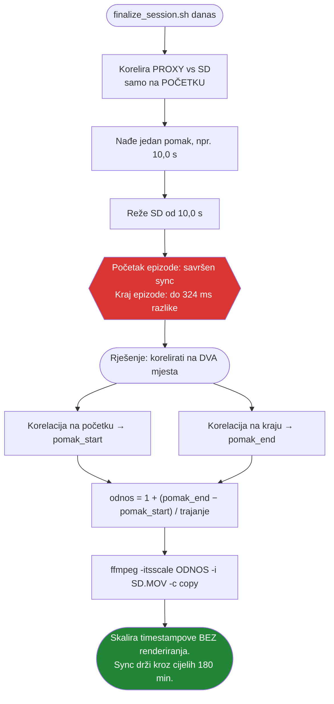
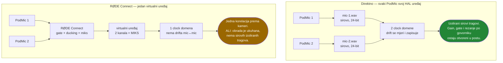
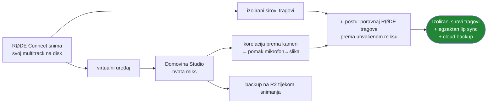
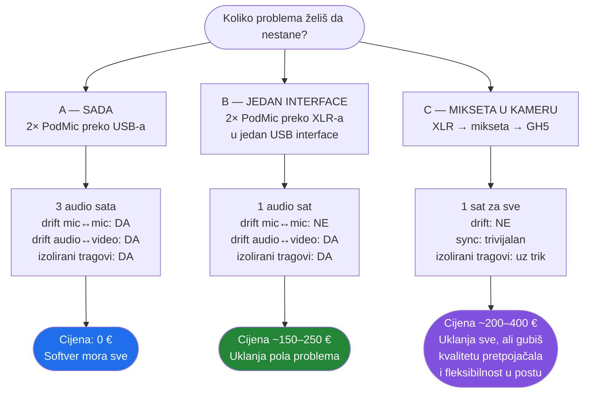
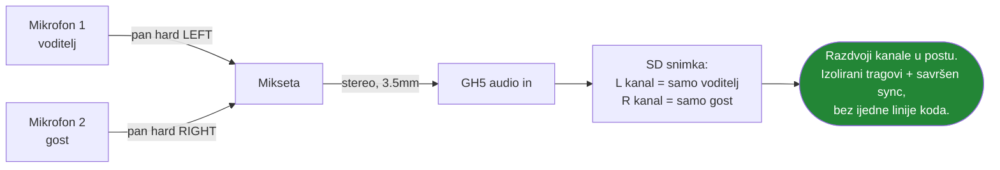

# Kako se lip sync doista zna u realnom vremenu

Odgovor na pitanje: *audio kasni značajno manje od videa s Elgata, satovi nisu
usklađeni, pa kako se to pametno automatski sinkronizira — i kako znam da pomak
ostaje isti kroz 180 minuta?*

---

## Kratki odgovor

1. **Host clock ne rješava lip sync sam.** On daje egzaktno, driftom neokaljano
   *relativno* poravnanje, ali svaki lanac ima svoju latenciju koju timestamp ne
   vidi. Video s Elgata je označen 40–100 ms **kasnije** od zvuka iz mikrofona za
   isti stvarni trenutak.
2. **Korelacija HDMI zvuka rješava upravo tu razliku** — i to kontinuirano, sama
   od sebe, iz govora u sobi. HDMI zvuk iz GH5 putuje **istim lancem kao video
   frameovi**, pa razlika „mikrofon vs HDMI zvuk" *jest* razlika „mikrofon vs
   slika". To je automatski pljesak, 3600 puta po epizodi.
3. **Pljesak ti treba točno jednom** — ne po epizodi, nego jednom kao kalibracija,
   da provjeriš jednu jedinu pretpostavku: da je u tvom GH5 HDMI zvuk poravnan s
   HDMI slikom.
4. **Ne, pomak nije konstantan kroz 180 minuta.** Drift ima statični dio (velik,
   lako se ispravlja) i termalni dio (mali, nelinearan). Zato se pomak **mjeri kroz
   cijelu snimku**, ne jednom na početku.
5. **Softverski je izvedivo** — Riverside, Descript i Zencastr rade upravo ovo.
   XLR mikseta u kameru je bulletproof i uklanja cijelu klasu problema, ali nije
   nužna. Postoji i jeftinija srednja opcija koja rješava pola problema.

---

## 1. Tri neovisna sata

Ovo je izvor svih problema. Nemaš jedan sat, nego tri (odnosno četiri) skupine
kristala koje nitko ne sinkronizira.



Ključno: **slika i HDMI zvuk dijele isti sat (kamerin)**. To je jedina sretna
činjenica u cijeloj priči i na njoj se sve gradi.

I: **SD snimka nikad ne prolazi kroz Mac**, pa je jedina stvar koju host clock ne
može ni dotaknuti.

---

## 2. Što timestamp doista znači — i što ne znači

Ovo je srž tvog pitanja. Timestamp **nije** trenutak kad se nešto dogodilo u sobi.
To je trenutak kad su podaci došli do HAL-a / drivera.



> Latencije u koracima su **procjene** dok se ne izmjere na tvom lancu. Red
> veličine je pouzdan, točan broj nije — i ne treba biti, jer se mjeri automatski.

### Zašto naivno poravnanje po satu daje pogrešan rezultat

Za pljesak u stvarnom trenutku `T`:

| | Stvarno | Označeno |
|---|---|---|
| Zvuk iz mikrofona | `T` | `T + 10 ms` |
| Slika s Elgata | `T` | `T + 100 ms` |

Složiš li ih po označenim vremenima, slika pljeska pada **90 ms nakon** zvuka
pljeska. Čuješ udarac, pa 90 ms kasnije vidiš da su se ruke spojile.

To je smjer koji je perceptivno najgori — ljudsko uho tolerira da zvuk *zaostaje*
za slikom oko dvostruko više nego da je *pretječe* (grubo: prag detekcije oko
−45 ms za zvuk naprijed, oko +90 ms za zvuk nazad). 90 ms zvuka naprijed se
**jasno vidi.**

**Ovo je točno ono što si intuirao. Sat sam po sebi nije dovoljan.**

---

## 3. Zašto je korelacija HDMI zvuka „automatski pljesak"

Sad dolazi rješenje. HDMI zvuk iz GH5 nije tu da bi se koristio u miksu — on je
tu jer **putuje potpuno istim lancem kao video frameovi**: isti kamerin sat, isti
HDMI stream, isti Elgato buffer, isti driver, isti PTS mehanizam.



**Zato ne treba pljesak po epizodi.** Govor u sobi je test signal. Aplikacija
korelira anvelopu svake sekunde na pokretnom prozoru od 6 s i dobiva vremenski
niz izmjerenih pomaka — ne jedan broj s početka, nego mjerenje kroz cijelu
epizodu.

Anvelopa na 1 kHz umjesto sirovog signala na 48 kHz nije šteta: rezolucija je
1 ms, daleko finija od praga percepcije, a robusnija je na to što PodMic i GH5-ov
ugrađeni mikrofon zvuče bitno različito.

Testirano na umjetnim pomacima 0 / +100 / −60 ms → izmjereno s greškom
**pod 0,1 ms** i pouzdanošću 1,00.

---

## 4. Pljesak: treba, ali samo jednom

Cijela stvar iz točke 3 stoji na **jednoj pretpostavci**: da je u HDMI izlazu GH5
zvuk poravnan sa slikom. To je razumna pretpostavka (HDMI je emitirajući signal,
embedded audio je vezan na frameove), ali nije zakon prirode i vrijedi je
provjeriti jednom.



Pljesak na početku svake epizode je i dalje **dobra navika** — nije potreban za
sync, ali daje transient s visokim odnosom signal/šum za brzu ručnu provjeru ako
nešto ispadne čudno. Traje sekundu.

---

## 5. Drift: statični dio je velik, dinamični je mali

Sad na drugi dio tvog pitanja — je li drift dinamičan kroz snimanje.

Odstupanje kristala ima dvije komponente:

| Komponenta | Uzrok | Veličina | Ponašanje |
|---|---|---|---|
| **Statična** | proizvodna tolerancija | ±10–50 ppm | konstantna, linearna kroz snimku |
| **Termalna** | kristal se grije | par ppm | nelinearna, najveća u prvih 20–30 min |

Što to znači na 180 minuta (10 800 s):

| Odstupanje | Nakupljena razlika kroz 180 min |
|---|---|
| 1 ppm | 10,8 ms |
| 10 ppm | 108 ms |
| **30 ppm (tipično)** | **324 ms** |
| 50 ppm | 540 ms |

Dakle: **statični drift je taj koji ubija snimku** — 324 ms na kraju epizode je
katastrofa. Ispravlja se lako, jer je linearan: jedan resample odnos ga skine
gotovo u nulu.

**Termalni drift je ono što ostaje.** Par ppm varijacije kroz snimku ostavlja
rezidual reda **10–30 ms** ako koristiš samo jedan globalni odnos. To je na granici
percepcije — vjerojatno neprimjetno u razgovoru, ali nije nula.



---

## 6. Najveća rupa: SD master na 180 minuta

Ovo je stvar koju moje trenutno rješenje **ne pokriva**, a upravo je ono što si
pitao — „kako znam da je snimka konstantno offsetana".

Nije konstantno. Evo zašto.

Video koji snima Mac (proxy) je postavljen na **Macov sat** — svaki frame ide na
mjesto svog PTS-a. Ako kamera proizvede malo više ili manje frameova od nominalnog,
proxy to apsorbira i ostaje točan.

SD snimka **nema tu korist**. Ona je taktirana kamerinim satom od početka do kraja.
Ako kamerin kristal ide 30 ppm brzo, datoteka koja tvrdi da traje 10 800 s stvarno
pokriva 10 799,68 s stvarnog vremena.



`-itsscale` je ključan detalj: mijenja samo vremenske oznake, ne dira ni jedan
frame, pa ostaje zero-render filozofija cijelog projekta.

**Implementirano.** Skripta korelira na početku i na 85 % snimke, provjeri je li
rezultat u realnom rasponu (< 500 ppm) i score dovoljan, pa primijeni `-itsscale`.
Za snimke kraće od 7 minuta preskače — drift je tada zanemariv.

---

## 7. Što aplikacija radi danas vs. što treba dodati

| | Stanje |
|---|---|
| Relativno poravnanje mikrofona međusobno | ✅ egzaktno, iz host clocka |
| Mjerenje drifta po mikrofonu | ✅ uživo u ppm, u manifest |
| Ispravak drifta mikrofona | ✅ jedan globalni odnos |
| Pomak mikrofon → slika | ✅ mjeren korelacijom, kontinuirano |
| Prikaz „sat vs korelacija" kao provjera | ✅ ako se razilaze > 40 ms, alarm |
| Vremenski niz izmjerenog pomaka u manifest | ✅ uzorak svakih 5 s, samo pouzdani |
| **Primjena izmjerenog pomaka na miks** | ✅ medijan, dodan na host-clock pomak |
| Detekcija „šeta li pomak kroz snimku" | ✅ prva vs druga polovina, upozorenje > 25 ms |
| Trajektorija drifta mikrofona (svakih 30 s) | ✅ u manifestu |
| Ispravak drifta mikrofona po dijelovima | ✅ ako odstupanje od pravca > 8 ms |
| Ispravak drifta SD mastera (`-itsscale`) | ✅ korelacija na dva mjesta |
| **Kalibracijska konstanta iz pljesak-testa** | ❌ treba dodati |

### Kako se pomak primjenjuje

Medijan, ne prosjek — jer u tišini korelacija daje besmislice, a jedan izlet od
−400 ms bi prosjek uništio. Uzorci s pouzdanošću pod 0,3 se odbacuju prije
medijana.

```
ukupni_pomak_mikrofona = pomak_iz_host_clocka + izmjerena_latencija_lanca
```

Primjer iz stvarnog izlaza skripte:

```
🎯 Pomak mikrofon→slika iz korelacije: +92.3 ms  (36 mjerenja, raspon 6.4 ms)
   prva polovina +91.0 ms → druga polovina +93.7 ms
   ✅ Pomak je stabilan kroz snimku (promjena 2.7 ms) — globalni ispravak je dovoljan.

🛠️  Ispravljam drift i poravnavam mikrofone…
   mic-1      +342 ms tišine na početak  (sat +250.0 ms + lanac +92.3 ms)
   mic-2      režem 0.0277 s s početka   (sat -120.0 ms + lanac +92.3 ms)
```

Obrati pažnju na `mic-2`: host clock je govorio −120 ms (reži), ali nakon dodavanja
latencije lanca ukupno je −27,7 ms — još uvijek rezanje, ali četiri puta manje.
Da se latencija ignorirala, taj bi trag bio 92 ms van syncа.

**Ovo je odgovor na „šeta li pomak kroz 180 minuta": skripta ti kaže.** Usporedi
prvu i drugu polovinu snimke; ako se razlikuju više od 25 ms, javi da jedan
globalni ispravak nije dovoljan.

---

## 7b. Dvije postave mikrofona — RØDE Connect ili direktno

Ako oba PodMic-a idu u **RØDE Connect**, on ih sam agregira, radi prelijevanje
glasova, gate i miks, i izlaže **virtualne** CoreAudio uređaje. Tada aplikacija
hvata jedan ulaz i cijeli problem se svodi na **jednu korelaciju prema kameri** —
drift između mikrofona nestaje jer ga je RØDE već poravnao kod sebe.

To je točno i legitimno pojednostavljenje. Ali ima cijenu koju treba znati.



### Bitno o RØDE Connectu

**Virtualni uređaj daje miks, ne izolirane tragove.** Na Macu se pojave tri
uređaja, svi 2-kanalni:

| Uređaj | Što je |
|---|---|
| `RØDE Connect System` | **zvuk sustava**, ne mikrofoni — nikad ga ne dodjeljuj kao mikrofon |
| `RØDE Connect Virtual` | virtualni ulaz/izlaz |
| `RØDE Connect Stream` | miks za streaming aplikacije |

Dva kanala znače **stereo miks**, ne četiri odvojena mikrofona. Izolirani tragovi
u starom tijeku rada (`PodMic USB Mic1.wav`, `StereoMix.wav`) dolaze iz
**vlastitog multitrack recordera RØDE Connecta**, a ne iz virtualnog uređaja.

Zato je najbolji hibrid:



RØDE-ovi izolirani tragovi su međusobno već poravnati (isti program, isti izvor),
pa je dovoljna jedna korelacija njihovog `StereoMix.wav` prema miksu koji je
uhvatila aplikacija — i svi tragovi naslijede taj pomak. To je u suštini ono što
je `podcast_sync.sh` već radio.

### Kako znaš koji je virtualni uređaj pravi

Ne pogađaj i ne vjeruj imenu. **Uključi Pregled i govori** — mjerači rade i prije
snimanja, pa se odmah vidi koji ulaz nosi mikrofone. (Ranije mjerači nisu radili
izvan snimanja; popravljeno.)

---

## 8. Hardverske alternative — poštena ljestvica



### Bitno: tvoji mikrofoni su već XLR

RØDE PodMic USB ima **i USB-C i XLR izlaz**. To znači da su opcije B i C otvorene
bez kupovine novih mikrofona.

### Trik za opciju C: izolirani tragovi ipak ostaju

Najčešća zamjerka mikseti u kameru je da dobiješ jedan miksani stereo trag. Ne
mora biti tako:



Cijena tog trika: GH5-ova pretpojačala i 16-bit zapis umjesto 24-bit s dedicated
interfacea, i nula fleksibilnosti za gain u postu.

---

## 9. Preporuka

**Softver je izvediv i vrijedi ga probati.** Fizika je na tvojoj strani: HDMI zvuk
i slika dijele sat, pa korelacija mjeri točno onu veličinu koja ti treba, i to
kontinuirano. To nije trik — to je isto ono što rade komercijalni servisi.

Konkretno, po redu:

1. **Odradi jednokratnu kalibraciju pljeskom** (točka 4). 5 minuta, i znaš stoji li
   temeljna pretpostavka na tvom lancu.
2. **Snimi 20-minutnu probu s oba mikrofona.** Pogledaj `driftPPM` u manifestu — to
   je jedini broj koji ne mogu predvidjeti umjesto tebe, a odlučuje koliko je
   problem velik.
3. **Dodaj trajektoriju drifta i `-itsscale`** (točka 7) prije prve prave epizode od
   180 minuta. Bez toga kraj epizode nije pokriven.
4. **Miksetu razmatraj tek ako proba pokaže drift preko ~50 ppm** ili ako te
   rezidual smeta. Nemoj kupovati na osnovi teorije — kupuj na osnovi izmjerenog
   broja iz koraka 2.

Ono što nikako ne radi: pretpostaviti da je pomak konstantan i ispraviti ga jednom
na početku. Na 20 minuta prođe. Na 180 ne.
