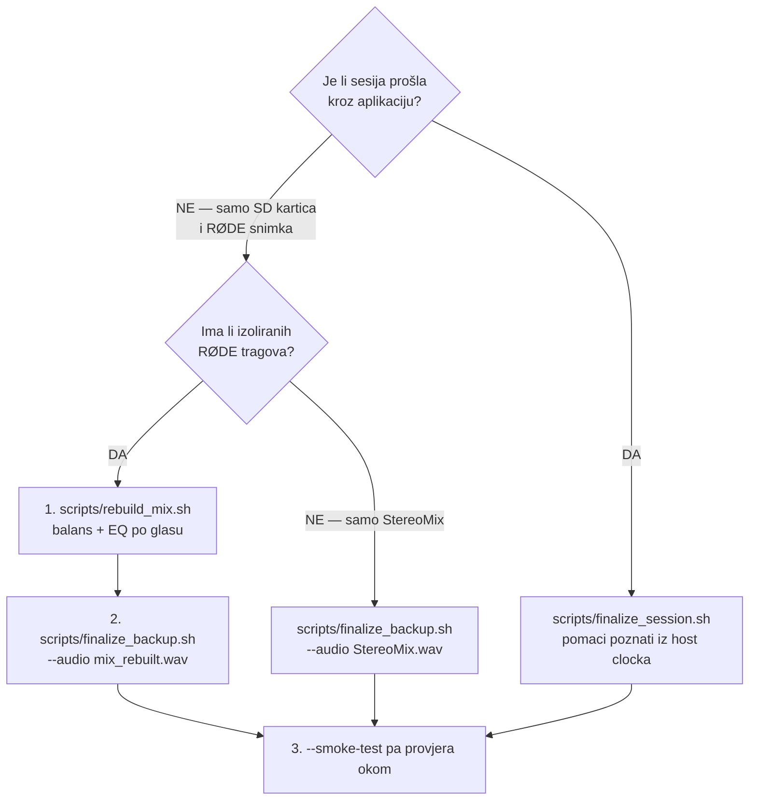

# Priprema snimanja — što napraviti prije, tijekom i poslije

Kontrolna lista za voditelja koji je istovremeno i tonac. Sve brojke niže su
**izmjerene na ovom hardveru 2026-07-28**, nakon epizode u kojoj je zvuk snimljen
26 dB pretiho i s neuravnoteženim mikrofonima. Objašnjenje odakle koji broj je na
dnu, u poglavlju „Zašto baš te brojke".

Dopunjuje [`STUDIO_MAP.md`](STUDIO_MAP.md) (tok signala) i [`LESSONS.md`](LESSONS.md)
(izmjereni brojevi i bugovi).

---

## 1. Gostu, prije dolaska

Reći **prije** snimanja, ne dok već sjedi:

> **Mikrofon će ti biti oko 15 cm od usta — otprilike širina šake.**
> Govori **u vrh** mikrofona, ne preko njega. Kad se udaljiš, glas ti postane
> tiši i „prostorniji", a kad priđeš preblizu, postane bubnjav.

Ovo je jedina stvar koju gost mora znati, i jedina koju u postu **ne možeš
popraviti** ako se zaboravi — udaljenost mijenja i razinu i boju glasa
istovremeno, a te dvije stvari se u snimci više ne daju razdvojiti.

Praktično: stavi oznaku na stol gdje ide stolica, ili namjesti krak mikrofona
prije nego gost sjedne. Krak drži udaljenost stabilnom kroz tri sata; bez njega
se čovjek naginje naprijed-nazad i razina pluta.

---

## 2. Oprema, prije snimanja

| # | Korak | Kako provjeriti |
|---|---|---|
| 1 | **Pop filter skinut** s oba mikrofona | PodMic ga ima ugrađenog iza rešetke |
| 2 | **Gain 58 dB** na oba PodMica | `swift scripts/mic_gain.swift list` |
| 3 | Oba mikrofona na **15 cm**, usmjerena u usta | oznaka na stolu / krak namješten |
| 4 | RØDE Connect: obrada po kanalu (APHEX) **isključena** | obrada se radi u postu, gdje se može poništiti |
| 5 | RØDE Connect snima **multitrack** | izolirani tragovi su spasili epizodu 2026-07-28 |
| 6 | Kamera snima na SD karticu | backup koji ne ovisi o Macu |

Postavljanje gaina:

```bash
swift scripts/mic_gain.swift list              # što je sada
swift scripts/mic_gain.swift set "PodMic" 58   # oba mikrofona odjednom
```

RØDE Connect **nema** AppleScript rječnik ni URL shemu, pa se njegove postavke ne
mogu skriptirati. Gain se može, jer nije njegova postavka nego mikrofonova —
macOS ga izlaže kao `kAudioDevicePropertyVolumeDecibels`. Raspon PodMica USB je
**22–63 dB**, upis prolazi i dok RØDE Connect radi.

> ID-evi uređaja se mijenjaju između spajanja (viđeno 184 → 186 u istoj sesiji).
> Zato skripta uvijek nabraja iznova umjesto da pamti ID.

---

## 3. Proba glasa, prije snimanja

Trideset sekundi, oboje govore normalnim glasom s radne udaljenosti. Gleda se:

- **vrhovi oko −10 dBFS** dok normalno govorite; mjerač u gornjoj trećini
- **crveno nikad**
- oba glasa **na sličnoj razini** — ako jedan bode u oči, netko je na krivoj udaljenosti

Ako su vrhovi ispod −20 dBFS, nešto nije u redu — provjeri je li gain doista
postavljen i je li netko previše odmaknut. To je jedina prilika da se to uhvati:
poslije se zna jedino podići, a s podizanjem raste i šum.

---

## 4. Tijekom snimanja

- Ne diraj gain. Promjena usred snimke znači skok razine koji se u postu ne da
  čisto poništiti.
- Ako netko udari u stol ili mikrofon, **reci naglas kad se to dogodilo** — lakše
  je naći jedan trenutak nego pretražiti tri sata. (U epizodi od 2026-07-28 jedan
  takav udarac na 1:00:08 bio je 25 dB iznad govora.)
- Zdravstvena ploča u aplikaciji pokriva disk, ispale mikrofone, tišinu i klipanje.
  **Ne pokriva „presiho"** — to je otvorena rupa, vidi `HealthMonitor.swift`.

---

## 5. Poslije snimanja

Koji put kroz post ovisi o tome što je preživjelo:



Uvijek napravi **smoke test prije punog exporta** — 45 s iz sredine, provjeri
sinkron okom. Puni mux 4K epizode traje 25–40 minuta i šteta ga je ponavljati.

```bash
# 1. miks iz izoliranih tragova (balans i EQ se MJERE, ne pogađaju)
./scripts/rebuild_mix.sh \
  --mic "/Volumes/DOMOVINA1TB/rode_connect_output/<datum>/PodMic USB Mic1.wav" \
  --mic "/Volumes/DOMOVINA1TB/rode_connect_output/<datum>/PodMic USB Mic2.wav" \
  --output <mapa>/mix_rebuilt.wav

# 2. provjera prije nego se potroši pola sata
./scripts/finalize_backup.sh --camera <SD>.MP4 --audio <mapa>/mix_rebuilt.wav \
  --output-dir <mapa> --loudness --smoke-test

# 3. finalni export za YouTube
./scripts/finalize_backup.sh --camera <SD>.MP4 --audio <mapa>/mix_rebuilt.wav \
  --output-dir <mapa> --loudness [--start 10] [--end 1:44:20]
```

**Normalizaciju radi samo jedan alat u lancu.** `rebuild_mix.sh` namjerno ostavlja
miks na prirodnoj razini; pojačanje i limiter su u `finalize_backup.sh`. Dvije
faze pojačanja su već jednom proizvele tvrdo klipanje kroz cijelu snimku.

---

## 6. Zašto baš te brojke

Sve mjereno na epizodi od 2026-07-28 (1:44:20, dva PodMica USB + GH5).

### Udaljenost: 15 cm

| | izmjereno u epizodi | procijenjena udaljenost |
|---|---|---|
| voditelj | +9,7 dB viška na 90–150 Hz | ~5–8 cm |
| gošća | bez viška basa, 3,4 dB tiša | ~25–35 cm |

Kardioidni mikrofon diže bas kad mu priđeš (proximity efekt): oko +10 dB na 5 cm,
+3 dB na 15 cm, ~0 na 30 cm. Na 15 cm je efekt još blag, a razina je dovoljno
iznad šuma prostorije. **Ista udaljenost za oboje izjednačava i razinu i boju
odjednom** — i time uklanja potrebu za popravkom u postu.

### Pop filter: skinut

Izmjereno na PodMicu, isti govornik, ista udaljenost, jedina promjena je filter:

| pojas | s filterom | bez | razlika |
|---|---|---|---|
| 2–4 kHz | −1,7 | +0,8 | **+2,4 dB** |
| 6–8 kHz | −5,7 | −3,2 | **+2,5 dB** |
| **8–12 kHz** | −6,2 | −0,2 | **+6,0 dB** |
| 12–16 kHz | −18,5 | −15,3 | **+3,2 dB** |

(dB su relativni na pojas 1–2 kHz, dakle boja a ne glasnoća)

Šest dB na 8–12 kHz je točno onaj manjak visina zbog kojeg je voditeljev trag u
epizodi zvučao tupo. Plozivi se pokrivaju udaljenošću, govorom malo izvan osi
(10–20°) i rezom ispod 75 Hz koji `rebuild_mix.sh` ionako radi.

### Gain: 58 dB

Bilo je 50 dB. Izmjereno direktno s mikrofona na 15 cm, bez filtera:

| | izmjereno na 50 dB |
|---|---|
| vrh u 60 s | −16,2 dBFS |
| tipičan vrh (p90 po sekundi) | −19,6 dBFS |
| najglasniji trenutak u 104 min* | −11,6 dBFS |

\* iz epizode, preračunato na 15 cm

Na 58 dB tipični vrhovi sjedaju na ~−11,6 dBFS, a najglasniji trenutak epizode na
~−4 dBFS — bez klipanja, uz rezervu. Strop je 63 dB.

**Hardver ne može riješiti sve.** Ni na maksimumu se ne dolazi do razine na kojoj
post ne treba ništa raditi, jer je raspon ovog glasa neobično velik: 32 dB između
tipičnog i najglasnijeg trenutka. Zato limiter u postu ostaje dio lanca. Cilj je
spustiti popravak s +26 dB (2026-07-28) na ~+12 dB, ne na nulu.

### Odnos glasa i šuma — zašto je udaljenost važnija od svake obrade

Mjereno u sekundama u kojima **nitko** ne govori:

| trag | govor | šum u tišini | **odnos** | udaljenost |
|---|---|---|---|---|
| voditelj | −42,0 dBFS | −61,0 dBFS | **19,1 dB** | ~6 cm |
| gošća | −45,4 dBFS | −51,1 dBFS | **5,7 dB** | ~30 cm |

Kamioni s ceste i ventilator ulaze **skoro isključivo kroz udaljeniji mikrofon** —
on je jednako blizu sobi kao i glasu. Ispod ~10 dB odnosa nijedan alat za čišćenje
šuma ne pomaže, što je izmjereno na pet alata ([`CISCENJE_ZVUKA.md`](CISCENJE_ZVUKA.md)).

Gost na 15 cm umjesto 30 cm dobiva **~6 dB**, dakle s 5,7 na ~11,7 dB — tek tu obrada
uopće ima smisla. **Pojačanje gaina ovo NE popravlja**: gain diže glas i šum jednako,
odnos ostaje isti. Popravlja ga samo udaljenost i zatvoren prozor.

### Preslušavanje između mikrofona

Izmjereno **−11 dB** u epizodi (svaki mikrofon čuje drugog govornika 11 dB tiše),
**−17 dB** u testu na 15 cm s praznim drugim mjestom.

Posljedica za post: EQ na jednom tragu ne može ukloniti taj glas iz drugog traga.
Ostaje ga ~11 dB ispod. Zato balans i EQ po tragu rade, ali ne savršeno — a gate
ima premalo razdvojenosti da bi radio čisto.
