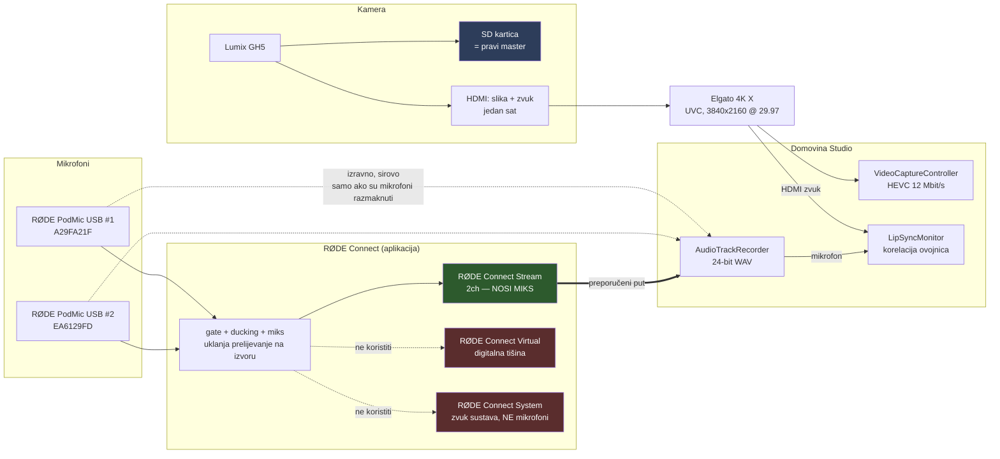
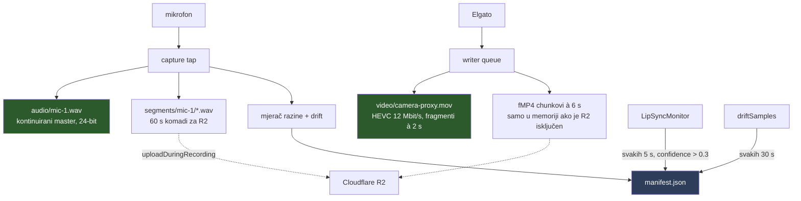
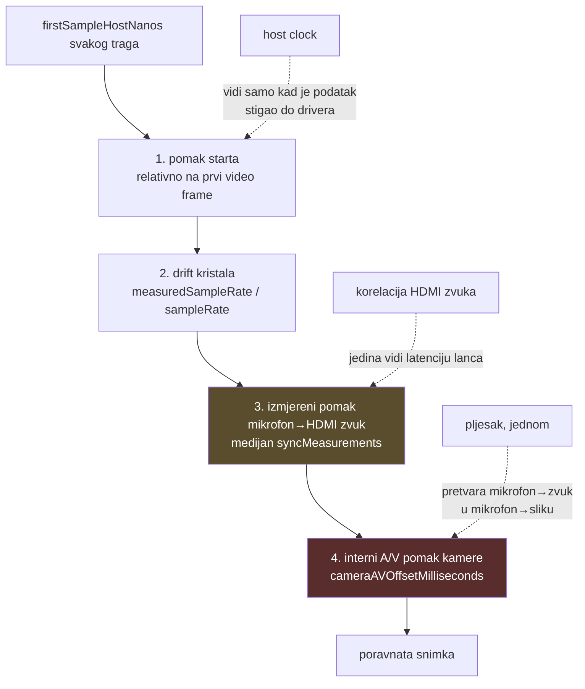
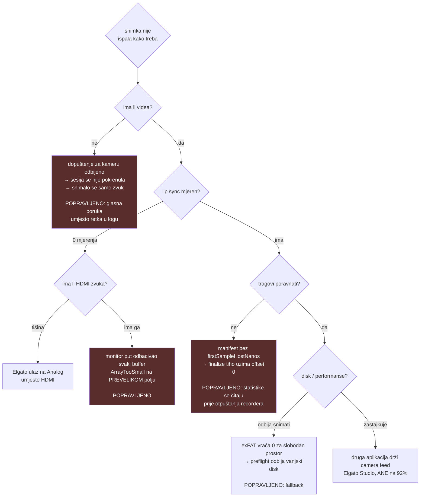
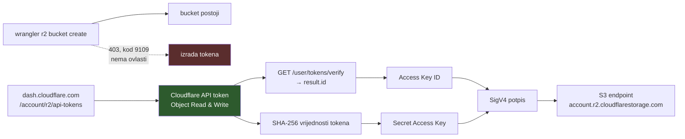

# Karta studija — kuda ide koji signal i gdje puca

Dopuna `LESSONS.md` (izmjereni brojevi i pronađeni bugovi) i `LIP_SYNC_THEORY.md`
(zašto sync radi). Ovdje je **oblik sustava**: koji signal kuda putuje, kojim
redom se ispravlja, i gdje je u praksi puknuo.

Sve niže je provjereno na hardveru 2026-07-27 i 2026-07-28, ne izvedeno iz koda.

---

## 1. Tok signala

Dvije topologije zvuka. Kamera je u obje ista.

**Izmjereno, ne pretpostavljeno.** Snimao sam sva tri virtualna uređaja
istovremeno uz sirove mikrofone, s RØDE Connectom pokrenutim:

| uređaj | max | zaključak |
|---|---|---|
| RØDE Connect **Stream** | −56,9 dB | nosi miks |
| RØDE Connect Virtual | −91,0 dB | tišina |
| RØDE Connect System | −120 dB | zvuk sustava |
| PodMic sirovi (najglasniji) | −57,1 dB | referenca |

**Monitor Out u RØDE Connectu ne treba dirati.** Izgleda kao da bi to bio put
prema drugim aplikacijama, ali nije — on odlučuje samo gdje *ti* slušaš. Miks
stiže do nas i kad je na „No Output Selected".

Driver instalira sva tri virtualna uređaja **trajno**, pa njihovo postojanje ne
znači ništa. Samo pokrenuta aplikacija znači da je miks živ; bez nje je tišina.

---

## 2. Što se zapisuje tijekom snimanja

Ništa se ne spaja nakon zaustavljanja. Sve raste paralelno, od prve sekunde.

Zeleno preživljava normalno zaustavljanje bez ijedne dodatne operacije. R2
segmenti su **neovisna kopija za slučaj katastrofe**, a ne dio normalnog tijeka —
brišu se lokalno čim su poslani.

Ako je R2 isključen, fMP4 chunkovi se odbacuju u `UploadQueue.enqueue`
(`guard client != nil`). Manifest ih zato više ne bilježi s lokalnom putanjom —
inače bi tvrdio da postoji 18 datoteka kojih nema.

---

## 3. Lanac ispravaka lip synca

Redoslijed nije proizvoljan. Player u Post tabu primjenjuje **isti redoslijed**
kao `finalize_session.sh`, zato ono što čuješ jest ono što ćeš dobiti.

**Sat i korelator se ne poklapaju i ne trebaju.** Izmjereno na pravoj snimci: sat
je javio −219 ms, korelator +223 ms. Sat vidi samo trenutak dolaska do drivera;
razlika je stvarna latencija lanca koju sat po definiciji ne može izmjeriti.

**Pomak je konstanta po sesiji, ne po sustavu.** Izmjereno kroz dan: +153, +216,
+222, +225 ms u različitim pokretanjima, a unutar pojedine snimke stabilno na
±10 ms. Da je netko izmjerio jednom i zakucao broj, polovica epizoda bila bi
kriva za ~70 ms.

Korak 4 je **jedini još neizmjeren** — kalibracija pljeskom nije napravljena, pa
postprodukcija pretpostavlja da je kamera interno poravnata.

---

## 4. Načini na koje je ovo puknulo

Svaki je pronađen na hardveru u jednom danu. Vrijedi ih pamtiti kao **klase**,
jer se svi svode na isto: tiho je izgledalo ispravno.

Zajednička nit: **ništa od ovoga nije javilo grešku.** Manifest je nastao,
datoteke su nastale, aplikacija je izgledala zdravo. Uhvatilo ih je jedino
provjeravanje *sadržaja* — broja uzoraka, razine u dB, postojanja polja — a ne
„je li se izvršilo bez greške".

Dvije poruke su aktivno **krivile pogrešnog krivca**:

- „provjeri je li HDMI zvuk iz kamere bio odabran" — a bug je bio u našem
  monitor putu;
- `kCMSampleBufferError_ArrayTooSmall` na polju šest puta **prevelikom** od
  potrebnog.

> Pravilo: kad dijagnostika optuži hardver, provjeri prvo da put kojim podatak
> dolazi uopće radi. Snimka je cijelo vrijeme imala uredan zvuk u
> `camera-proxy.mov` — writer put je radio, monitor nije, i nitko ih nije
> usporedio.

---

## 5. Cloudflare R2 — odakle dolaze ključevi

Wrangler može napraviti bucket, ali **ne može** napraviti S3 kredencijale.
Provjereno: OAuth token koji wrangler drži odbijen je na token-management API-ju
(HTTP 403, kod 9109).

Zato **jedan token doista je dovoljan** — nije zaobilaženje SigV4, nego su ta
dva podatka izvedena iz njega. Aplikacija to radi sama (Postavke → Cloudflare R2
→ „Izvedi ključeve"), a token se nigdje ne sprema; samo ono što je iz njega
izvedeno.

Adresa bucketa iz dashboarda se može zalijepiti cijela — account je prvi segment
putanje, a bucket **iza oznake `buckets`**, ne na fiksnoj dubini: segment između
njih je „default" na većini računa, ali „eu" drugdje.

---

## 6. Što ostaje otvoreno

| stavka | stanje |
|---|---|
| Kalibracija pljeskom | **nije napravljena** — bez nje je izmjereni pomak mikrofon→*zvuk*, ne mikrofon→*sliku* |
| R2 kredencijali | bucket postoji, ključevi se još nisu unijeli |
| Termika kroz 3 sata | neprovjereno pod trajnim 4K encodeom |
| `proRes422LT` na 4K | neprovjereno |
| 2-kanalni WAV s mono mikrofona | viđeno jednom (1,7 GB umjesto 0,9 GB); uzrok nije utvrđen |
